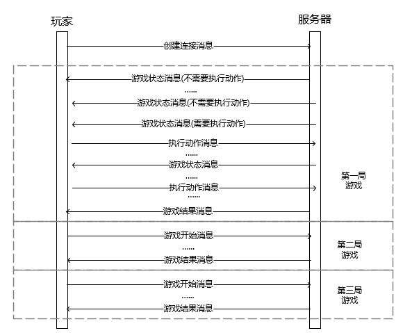

## 通信协议

下面从数据格式和消息收发时序两方面进行描述。

### 数据格式

所有的数据采用json格式进行存储，方便数据的编码和解码。在数据包发送时，首先发送长度为4的数据包长度，再发送数据包。

#### 卡牌描述信息

对于每一张卡牌，使用一个string进行存储，由该张卡牌的点数和花色组成

* 点数: 2, 3, 4, 5, 6,7, 8, 9, T, J, Q, K, A
* 花色: c(梅花), d(方块), s(黑桃), h(红桃),
* 示例: 'Ts' 表示黑桃10. 'Jc'表示梅花J, '4d'表示方块4

#### 动作描述信息

一共有四种动作，call, check, raise, fold

* raise: 使用'r' 和 金额进行表示，表明增加筹码至该金额，该金额为**当前轮次的加注筹码总额**。
* call: 使用'call'表示，表明响应上一个玩家的raise。
* check: 使用'check'表示，表明不进行加注(即check)。 call和check必定只有一个有效。
* fold: 使用'fold'表示，表明放弃该局游戏。
* 示例: 'call'表示call， 'r200'表示加注到200, 'f'表示fold

#### 创建连接消息

* 发送方: 玩家
* 接收方: 服务器
* 含义：玩家向服务器发起连接。

| 参数          | 类型     | 说明                       |
|-------------|--------|--------------------------|
| info        | string | 固定值 connect，区分该消息为创建连接消息 |
| name        | string | 玩家姓名                     |
| room_number | int    | 该房间游戏的最大人数               |
| game_number | int    | 连续对战的局数                  |

示例数据：

```json
{
    "info": "connect",
    "name": "Demo",
    "room_number": 2,
    "game_number": 2
}
```

####  玩家预备消息（只有第二局及之后的才需要发送）

* 发送方: 玩家
* 接收方: 服务器
* 含义: 在第二局及之后的游戏开始前发送给服务器，表明玩家已经准备好开始该局的游戏或退出。

| 参数     | 类型     | 说明                     |
|--------|--------|------------------------|
| info   | string | 固定值ready, 区分该消息为游戏预备消息 |
| status | string | start表示准备开始，exit表示退出   |

示例数据：

```json
{"info": "ready", "status": "start"}
```

#### 执行动作消息

* 发送方: 玩家
* 接收方: 服务器
* 含义: 当玩家收到游戏状态信息且表明轮到玩家执行动作时，将该执行动作消息发送给服务器，表明玩家执行的动作。

| 参数     | 类型     | 说明                                  |
|--------|--------|-------------------------------------|
| info   | string | 固定值action, 区分该消息为执行动作消息             |
| action | string | 一次动作的描述信息  call, check, r1234, fold |

示例数据：

```json
{
    "action": "call", 
    "info": "action"
}
```

#### 游戏状态消息

* 发送方: 服务器
* 接收方: 玩家
* 含义: 每当需要一个玩家执行动作时，将该条状态消息群发给所有玩家，表明目前的游戏状态。若消息中的action_position字段与position字段相同，则说明轮到该玩家执行动作，需要向服务器发送执行动作消息。

| 参数                   | 类型           | 说明                                                            |
|----------------------|--------------|---------------------------------------------------------------|
| info                 | string       | 固定值 state, 区分该消息为状态消息                                         |
| action_position      | int          | 目前需要执行动作的玩家所在的座位号                                             |
| position             | int          | 当前玩家所在的座位号，小盲位编号为0，依次增加                                       |
| legal_actions        | list(string) | 合法动作列表                                                        |
| +legal_actions[]     | string       | 某个动作，包含call, check, raise, fold                               |
| raise_range          | list(int)    | 可加注范围，长度为2,　分别表示最小加注和最大加注。仅当raise为合法动作时该字段有效。表示当前轮次的加注筹码总量范围。 |
| private_card         | list(string) | 玩家的手牌信息，list长度即为玩家的手牌数量                                       |
| +private_card[]      | string       | 一张牌的描述信息                                                      |
| public_card          | list(string) | 桌面公共牌信息，list长度即为玩家目前可见的公共牌数量                                  |
| +public_card[]       | string       | 一张牌的描述信息                                                      |
| players              | list(player) | 桌面上所有玩家的信息                                                    |
| +player              | player       | 某个玩家的信息                                                       |
| ++name               | string       | 玩家名字                                                          |
| ++position           | int          | 玩家位置                                                          |
| ++moneyLeft          | decimal      | 玩家剩余金额                                                        |
| ++totalMoney         | decimal      | 本局开始前的金额                                                      |
| action_history       | list(list)   | 所有玩家执行过的动作记录，列表长度为目前的轮数                                       |
| +action_history[]    | list         | 某一轮所有玩家执行过的动作，列表长度为该轮的回合数                                     |
| ++action_history[][] | history      | 某位玩家的一次动作                                                     |
| +++position          | int          | 位置                                                            |
| +++acion             | string       | 操作                                                            |
| +++timestamp         | string       | 操作时间                                                          |

示例数据

```json
{
    "position": 0,
    "action_position": 1,
    "legal_actions": [
        "fold",
        "check",
        "raise"
    ],
    "raise_range": [
        100,
        19900
    ],
    "private_card": [
        "5c",
        "4s"
    ],
    "public_card": [
        "Kc",
        "Qh",
        "Ad",
        "6s"
    ],
    "players": [
        {
            "position": 0,
            "money_left": 19900,
            "total_money": 20000,
            "name": "Demo"
        },
        {
            "position": 1,
            "money_left": 19900,
            "total_money": 20000,
            "name": "CallAgent"
        }
    ],
    "action_history": [
        [
            {
                "position": 0,
                "action": "call",
                "timestamp": "2020-07-06 18:45:44.509"
            },
            {
                "position": 1,
                "action": "check",
                "timestamp": "2020-07-06 18:45:44.515"
            }
        ],
        [
            {
                "position": 1,
                "action": "check",
                "timestamp": "2020-07-06 18:45:44.521"
            },
            {
                "position": 0,
                "action": "check",
                "timestamp": "2020-07-06 18:46:15.810"
            }
        ],
        []
    ],
    "info": "state"
}
```

#### 游戏结果消息

* 发送方: 服务器
* 接收方: 玩家
* 含义: 当一局对战游戏达到结束状态时，服务器将该条游戏结果消息群发给所有玩家。

| 参数                   | 类型            | 说明                           |
|----------------------|---------------|------------------------------|
| info                 | string        | 固定值 result, 区分该消息为游戏结果消息     |
| public_card          | list(string)  | 桌面公共牌信息，list长度即为玩家目前可见的公共牌数量 |
| +public_card[]       | string        | 一张牌的描述信息                     |
| action_history       | list(history) | 所有玩家执行过的动作记录，列表长度为目前的轮数      |
| +action_history[]    | list          | 某一轮所有玩家执行过的动作，列表长度为该轮的回合数    |
| ++action_history[][] | history       | 某位玩家的一次动作                    |
| +++position          | int           | 位置                           |
| +++acion             | string        | 操作                           |
| +++timestamp         | string        | 操作时间                         |
| players              | list(player)  | 桌面上玩家的信息                     |
| +player              | player        ||
| ++position           | int           | 玩家位置                         |
| ++name               | string        | 玩家名字                         |
| ++win_money          | decimal       | 玩家本局赢到的钱                     |
| ++money_left         | decimal       | 玩家剩余金额                       |
| ++total_money        | decimal       | 本局开始前的金额                     |

示例数据

```json
{
    "player_card": [
        [
            "5c",
            "4s"
        ],
        [
            "9s",
            "Td"
        ]
    ],
    "public_card": [
        "Kc",
        "Qh",
        "Ad",
        "6s",
        "Ts"
    ],
    "action_history": [
        [
            {
                "position": 0,
                "action": "call",
                "timestamp": "2020-07-06 18:45:44.509"
            },
            {
                "position": 1,
                "action": "check",
                "timestamp": "2020-07-06 18:45:44.515"
            }
        ],
        [
            {
                "position": 1,
                "action": "check",
                "timestamp": "2020-07-06 18:45:44.521"
            },
            {
                "position": 0,
                "action": "check",
                "timestamp": "2020-07-06 18:46:15.810"
            }
        ],
        [
            {
                "position": 1,
                "action": "check",
                "timestamp": "2020-07-06 18:46:15.816"
            },
            {
                "position": 0,
                "action": "check",
                "timestamp": "2020-07-06 18:46:56.826"
            }
        ],
        [
            {
                "position": 1,
                "action": "check",
                "timestamp": "2020-07-06 18:46:56.833"
            },
            {
                "position": 0,
                "action": "check",
                "timestamp": "2020-07-06 18:46:57.801"
            }
        ]
    ],
    "players": [
        {
            "position": 0,
            "win_money": -100,
            "moneyLeft": 19900,
            "totalMoney": 20000,
            "name": "Demo"
        },
        {
            "position": 1,
            "win_money": 100.0,
            "moneyLeft": 19900,
            "totalMoney": 20000,
            "name": "CallAgent"
        }
    ],
    "info": "result"
}
```

### 消息收发时序

消息收发时序如下图所示。

在游戏开始前，每个玩家向服务器发送**创建连接消息**，当一个房间的连接人数到达设定人数后，服务器开始游戏

在每一局游戏中，服务器将不断向玩家发送**游戏状态消息**，若该消息为需要执行动作的消息，则玩家需要向服务器**执行动作消息**。重复该流程执行游戏达到结束状态。此时，服务器将向所有玩家发送**游戏结果消息**。

在第二局及之后的游戏开始前，每个玩家需向服务器发送**玩家预备消息**，若均为开始则服务器进行下一局游戏。

当以进行的游戏局数到达设定的对战局数时，或者某玩家的连接断开时，或者某玩家在发送玩家预备消息时发送的为退出时，终止游戏的进行，服务器自动断开所有玩家的连接。



